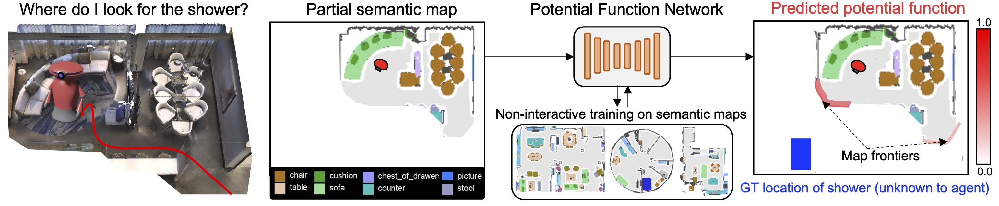

# PONI

This repository contains a Pytorch implementation of our CVPR 2022 paper:

[PONI: Potential Functions for ObjectGoal Navigation with Interaction-free Learning](https://arxiv.org/pdf/2201.10029.pdf)<br/>
Santhosh Kumar Ramakrishnan, Devendra Singh Chaplot, Ziad Al-Halah, Jitendra Malik, Kristen Grauman<br/>
Meta AI, UT Austin, UC Berkeley 

Project website: [https://vision.cs.utexas.edu/projects/poni/](https://vision.cs.utexas.edu/projects/poni/)


## Abstract
State-of-the-art approaches to ObjectGoal navigation rely on reinforcement learning and typically require significant computational resources and time for learning. We propose Potential functions for ObjectGoal Navigation with Interaction-free learning (PONI), a modular approach that disentangles the skills of 'where to look?' for an object and 'how to navigate to (x, y)?'. Our key insight is that 'where to look?' can be treated purely as a perception problem, and learned without environment interactions. To address this, we propose a network that predicts two complementary potential functions conditioned on a semantic map and uses them to decide where to look for an unseen object. We train the potential function network using supervised learning on a passive dataset of top-down semantic maps, and integrate it into a modular framework to perform ObjectGoal navigation. Experiments on Gibson and Matterport3D demonstrate that our method achieves the state-of-the-art for ObjectGoal navigation while incurring up to 1,600x less computational cost for training.

<p align="center">
  
</p>


## Installation

Clone the current repo and required submodules:
```
git clone git@github.com:srama2512/PONI.git
cd PONI
git submodule init
git submodule update
export PONI_ROOT=<PATH TO PONI/>
```
 Create a conda environment:
```
conda create --name poni python=3.8.5
conda activate poni
```

Install pytorch (assuming cuda 10.2):
```
conda install pytorch==1.9.1 torchvision==0.10.1 torchaudio==0.9.1 cudatoolkit=10.2 -c pytorch
```

Install dependencies:
```
cd $PONI_ROOT/dependencies/habitat-lab
pip install -r requirements.txt
python setup.py develop --all

cd $PONI_ROOT/dependencies/habitat-sim
pip install -r requirements.txt
python setup.py install --headless --with-cuda

python -m pip install detectron2 -f https://dl.fbaipublicfiles.com/detectron2/wheels/cu102/torch1.9/index.html

pip install torch-scatter -f https://data.pyg.org/whl/torch-1.9.0+cu102.html

cd $PONI_ROOT/dependencies/astar_pycpp && make
```

Install requirements for PONI:
```
cd $PONI_ROOT
pip install -r requirements.txt
```

Add repository to python path:
```
export PYTHONPATH=$PYTHONPATH:$PONI_ROOT
```


## Creating semantic map datasets

1. Download [Gibson](http://gibsonenv.stanford.edu/database/) and [Matterport3D](https://niessner.github.io/Matterport/) scenes following the instructions [here](DATASETS.md).

2. Extract Gibson and MP3D semantic maps.
    ```
    cd $PONI_ROOT
    ACTIVE_DATASET="gibson" python scripts/create_semantic_maps.py
    ACTIVE_DATASET="mp3d" python scripts/create_semantic_maps.py
    ```

3. Create dataset for PONI training. </br>
    a. First extract FMM distances for all objects in each map.
    ```
    cd $PONI_ROOT
    ACTIVE_DATASET="gibson" python scripts/precompute_fmm_dists.py
    ACTIVE_DATASET="mp3d" python scripts/precompute_fmm_dists.py
    ```
    b. Extract training and validation data for PONI.
    ```
    ACTIVE_DATASET="gibson" python scripts/create_poni_dataset.py --split "train"
    ACTIVE_DATASET="gibson" python scripts/create_poni_dataset.py --split "val"
    ACTIVE_DATASET="mp3d" python scripts/create_poni_dataset.py --split "train"
    ACTIVE_DATASET="mp3d" python scripts/create_poni_dataset.py --split "val"
    ```
4. The extracted data can be visualized using [notebooks/visualize_pfs.ipynb](notebooks/visualize_pfs.ipynb).


## Training

To train models for PONI, predict-xy, predict-theta, and predict-action methods, copy over corresponding scripts from `$PONI_ROOT/experiment_scripts/<DATASET_NAME>/train_<METHOD_NAME>.sh` to some experiment directory and execute it. For example, to train PONI on Gibson:
```
mkdir -p $PONI_ROOT/experiments/poni/
cd $PONI_ROOT/experiments/poni
cp $PONI_ROOT/experiment_scripts/gibson/train_poni.sh .
chmod +x train_poni.sh
./train_poni.sh
```

## Pre-trained models

We release pre-trained models from the experiments in our paper:

|     Method     | Dataset |                          |     Checkpoints    |                    |
|:--------------:|:-------:|:------------------------:|:------------------:|:------------------:|
|      PONI      |  Gibson | [poni_123.ckpt](https://utexas.box.com/s/kjkjbegd58o5a2kf25sfac27zmc15cv9) | [poni_234.ckpt](https://utexas.box.com/s/5jsvjf3rg8yd6zcf7qjfchugstqp4rzf) | [poni_345.ckpt](https://utexas.box.com/s/mjgvp90ajyymfta700s9wsc7j73qu9mz) |
|   Predict-XY   |  Gibson | [pred_xy_123.ckpt](https://utexas.box.com/s/0yyzjor3l82ewldm1q8hq7z5xi2fb8a9) | [pred_xy_234.ckpt](https://utexas.box.com/s/q84u0fnqh153n21ympt7njm269u0cjfw) | [pred_xy_345.ckpt](https://utexas.box.com/s/z3kw3kylq76xojgstsfia7hbpb89frs7) |
|  Predict-theta |  Gibson | [pred_theta_123.ckpt](https://utexas.box.com/s/cqojj1gnq73brakwgzy16isfxjqdfgv1) | [pred_theta_234.ckpt](https://utexas.box.com/s/gmi28locbj2z2la2h11btbrcohuc6ae7) | [pred_theta_345.ckpt](https://utexas.box.com/s/z3zqg7865oc9h3a28v7843sdidfwjoq6) |
| Predict-action |  Gibson | [pred_act_123.ckpt](https://utexas.box.com/s/is6bppu25jgbvrjaibzs5rnb18zjaqzx) | [pred_act_234.ckpt](https://utexas.box.com/s/ddrogbg912ryt71m7nzhhbcsokh8khwh) | [pred_act_345.ckpt](https://utexas.box.com/s/kzjqxty44o7xbln7i9vddz557j0fqh27) |
|      PONI      |   MP3D  | [poni_123.ckpt](https://utexas.box.com/s/rakcdp0il6sbemqkv323svrzub2rvrdu) | [poni_234.ckpt](https://utexas.box.com/s/mei1wfecnungr1uyiwbroovwj7rux8gc) | [poni_345.ckpt](https://utexas.box.com/s/jv1tl4o0s8oob4g3ly2pwklei2cexeh4) |
|   Predict-XY   |   MP3D  | [pred_xy_123.ckpt](https://utexas.box.com/s/f3st176sajo7st3vqgx9fctcqypjxhyz) | [pred_xy_234.ckpt](https://utexas.box.com/s/x4jnmbjqvz0yahjug07hr8uvn68jwofi) | [pred_xy_345.ckpt](https://utexas.box.com/s/2w4qpxlp0kx8x2wtyypksvdiv91c0gz2) |
|  Predict-theta |   MP3D  | [pred_theta_123.ckpt](https://utexas.box.com/s/erqkindzb92lfvxhxa01zif53blak6ru) | [pred_theta_234.ckpt](https://utexas.box.com/s/exeegxodfooae824q5uwni4vwho93lvo) | [pred_theta_345.ckpt](https://utexas.box.com/s/wj9poyh8b4y7azkteduawwxiywzd0idm) |
| Predict-action |   MP3D  |                            | [pred_act_123.ckpt](https://utexas.box.com/s/1bx2rw3jrojhh2xrmwm3x2w7ftkwi6nq) |                            |


You can also download all models from [here](https://utexas.box.com/s/0v59eqktjs7hicbd16p2etlz2cn3w6g9):
```
mkdir $PONI_ROOT/pretrained_models && cd $PONI_ROOT/pretrained_models
wget -O pretrained_models.tar.gz https://utexas.box.com/shared/static/0v59eqktjs7hicbd16p2etlz2cn3w6g9.gz
tar -xvzf pretrained_models.tar.gz && rm pretrained_models.tar.gz
```

## ObjectNav evaluation on Gibson

We use a modified version of the Gibson ObjectNav evaluation setup from [SemExp](https://github.com/devendrachaplot/Object-Goal-Navigation).

1. Download the [Gibson ObjectNav dataset](https://utexas.box.com/s/tss7udt3ralioalb6eskj3z3spuvwz7v) to `$PONI_ROOT/data/datasets/objectnav/gibson`.
    ```
    cd $PONI_ROOT/data/datasets/objectnav
    wget -O gibson_objectnav_episodes.tar.gz https://utexas.box.com/shared/static/tss7udt3ralioalb6eskj3z3spuvwz7v.gz
    tar -xvzf gibson_objectnav_episodes.tar.gz && rm gibson_objectnav_episodes.tar.gz
    ```
2. Download the image segmentation model [[URL](https://utexas.box.com/s/sf4prmup4fsiu6taljnt5ht8unev5ikq)] to `$PONI_ROOT/pretrained_models`.
3. Copy the evaluation script corresponding to the model of interest from `$PONI_ROOT/experiment_scripts/gibson/eval_<METHOD_NAME>.sh` to the required experiment directory. 
5. Set the `MODEL_PATH` variable in the script to the saved checkpoint. By default, it points to the path of a pre-trained model (see previous section).
5. To reproduce results from the paper, download the pre-trained models and evaluate them using the evaluation scripts.
6. To visualize episodes with the semantic map and potential function predictions, add the arguments `--print_images 1 --num_pf_maps 3` in the evaluation script.


## ObjectNav evaluation on MP3D

We use the ObjectNav evaluation setup from [Habitat-Lab](https://github.com/facebookresearch/habitat-lab) for the MP3D dataset. 

1. Download the MP3D ObjectNav dataset [[URL](https://utexas.box.com/s/40f0lfoucz4xr8ty4xkqlgop5jaz6kwp)] to `$PONI_ROOT/data/datasets/objectnav/mp3d/v1`.
2. Download the image segmentation model [[URL](https://utexas.box.com/s/z6y09w6z279ew3rgaxjxlfb3y0x02gjs)] to `$PONI_ROOT/pretrained_models`.
3. Copy the evaluation script corresponding to the model of interest from `$PONI_ROOT/experiment_scripts/mp3d/eval_<METHOD_NAME>.sh` to the required experiment directory (say, `$EXPT_ROOT`). 
4. Set the `MODEL_PATH` variable in the script to the saved checkpoint. By default, it points to the path of a pre-trained model. Execute the eval script specifying the ids of 2 GPUs to evaluate on (0, 1 in this example). **Note:** In general, we found MP3D evaluation to be very slow on a single thread. The current MP3D evaluation code does not support multi-threaded evaluation. Instead, we split the MP3D val episode dataset into 11 parts (one for each scene), and run 11 single-threaded evaluations in parallel. By default, the first GPU evaluates on 6 parts (requiring ~20GB memory), and the second GPU evaluates on 5 parts (requiring ~16GB memory) simultaneously. If this exceeds the memory available on your GPU, please reduce the number of parts per GPU and increase the number of GPUs (i.e., modify `eval_<METHOD_NAME>.sh`). 
    ```
    ./eval_<METHOD_NAME>.sh 0 1
    ```
5. Merge results from the 11 splits.
    ```
    python $PONI_ROOT/hlab/merge_results --path_format "$EXPT_ROOT/mp3d_objectnav/tb_seed_100_val_part_*/stats.json"
    ```
6. To reproduce results from the paper, download the pre-trained models and evaluate them using the evaluation scripts.


## Acknowledgements

In our work, we used parts of [Semantic-MapNet](https://github.com/vincentcartillier/Semantic-MapNet), [Habitat-Lab](https://github.com/facebookresearch/habitat-lab), [Object-Goal-Navigation](https://github.com/devendrachaplot/Object-Goal-Navigation), and [astar_pycpp](https://github.com/srama2512/astar_pycpp) repos and extended them.

## Citation
If you find this codebase useful, please cite us:
```
@inproceedings{ramakrishnan2022poni,
    author       = {Ramakrishnan, Santhosh K. and Chaplot, Devendra Singh and Al-Halah, Ziad and Malik, Jitendra and Grauman, Kristen},
    booktitle    = {Computer Vision and Pattern Recognition (CVPR), 2022 IEEE Conference on},
    title        = {PONI: Potential Functions for ObjectGoal Navigation with Interaction-free Learning},
    year         = {2022},
    organization = {IEEE},
}
```

## License
This project is released under the MIT license, as found in the [LICENSE](LICENSE) file.